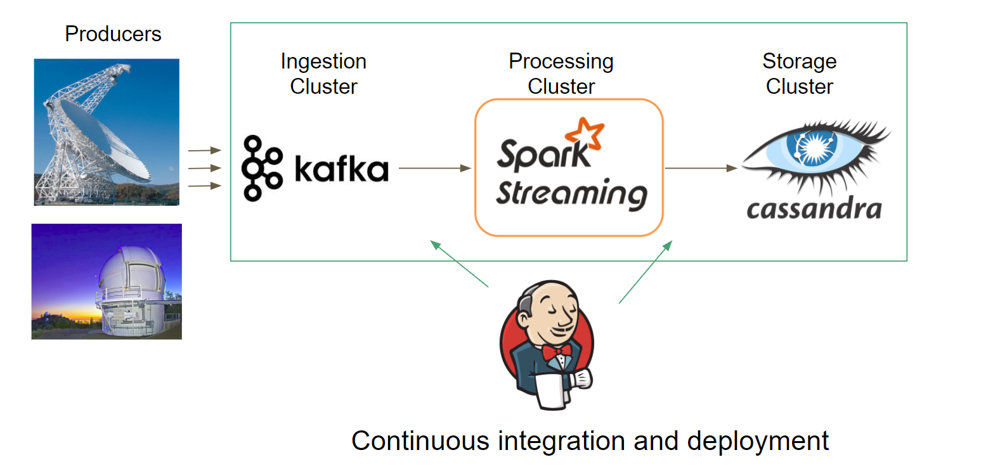

# Continuous integration and deployment on SETI streaming data detection

## Introduction:
SETI (the Search for Extraterrestrial Intelligence), the institute that looks for space aliens, collects 500GB streaming data every night. Given a suitable environment and sufficient time, life will develop on other planets. Such a civilization could be detected across interstellar distances, and may actually offer our best opportunity for discovering extraterrestrial life in the near future. If they observe a very interesting needle-like signal, it is of great value to immediately re-measure that anomaly within the same night. This project is finished in 3 weeks, the first part is to build a data pipeline to process SETI data, and second part is to implement continuous integration and deployment of the whole pipeline.  

## Stream pipeline:
The figure below shows how the streaming data pipeline is constructed. The SETI streaming data, as a producer, is ingested in Kafka to identify anomalous signals with Spark Streaming as a consumer, finally save results in a Cassandra database. Then Jenkins is utilized to implement continuous integration and deployment.

## Pipeline outcomes and implementation of continuous integration and deployment 
Two tables are saved. One is hit table and the second is anomalous table. The hit table saved the SETI data with simple conversion, which hold the similar information with raw data. There are a bunch of properties come with data, the two that SETI are interested are signal to noise ratio and drift rate. Signal to noise ratio identifies the high amplitude signal. The drift rate is defined by how fast the signal migrates. The anomalous table, on the other hand, saved the suspicious hits by group that should take the second measurement during same night.

In this demo, we assume that a researcher in SETI who is using my pipeline made a mistake. The drift rate they collect should multiple by 10. After he fixed the mistake, the system can update the code, stop the spark job and restart everything. The final tables in the demo shows that the new record is saved and the only difference of these two is drift rate, by a factor of 10. In the real pipeline, the old data should have been deleted. It is kept just for display purpose. For the whole CI/CD flow, the codes have a develop branch and master branch. the research fixed an error on the development branch. After it is push to the github, which webhooks with Jenkins. Jenkins will perform a unit test to make sure the code is good to run. After it is approved, it will make github merge the develop branch to the master. Then Jenkins will start another pipeline that can have the server to update the code, stop the current spark job and then restart everything.  Since whole process is more than 15 mins, it is shown in fast mode and trimed to short version. 

## Challenges:
I run into a couple of challenges of this project. 
* First, how to make the communication among Github, Jenkins and server. There are multiple ways of doing these. For example, we can write shell script in server to listen to github, but this cannot monitor the status of CD, if the system runs into issue upon restart, we cannot catch it right away. I decide to use Jenkins the build another rerun pipeline, which can alert when something goes wrong, where Jenkins can monitor both CI and CD process. 

* Second challenge is the unit test. How to make sure the code is the fit to run before restart everything is crucial in continuous integeration. I decide to specific seed in the random number generator. When it restarts, it starts from the same point, and the results are expected and could be predicted and examed. It is not perfect, and there is more items can be checked. It is currently a simple version due to the time constraint.

* The last is to understand the multi-tenancy in Cassandra. When the codes are updated and tables are deleted in order to rerun everything. It take long time for Cassandra to finish, taking both memory and CPU. When the system is re-started, it will resume the previous task. A good practice is to install them on separates nodes or it will affect spark performance a lot.

## Useful Links
Live Demo : clik [demo](http://bit.ly/Insightdemo2018)

Demo slides: clik [slides](http://bit.ly/Insightppt) 
